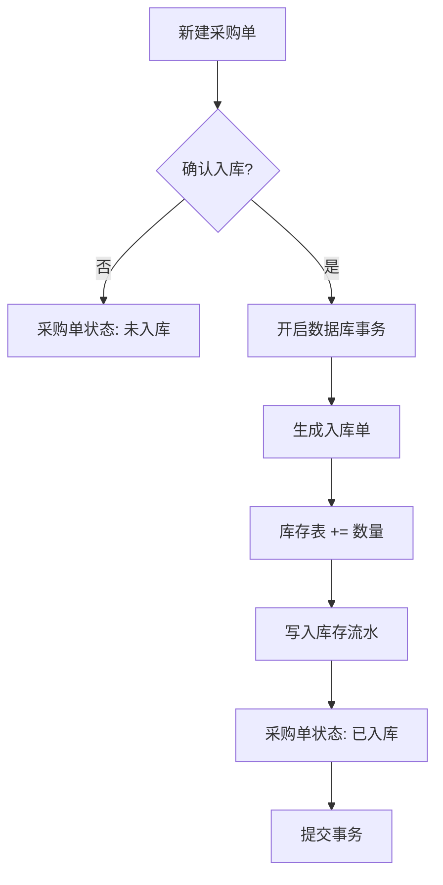
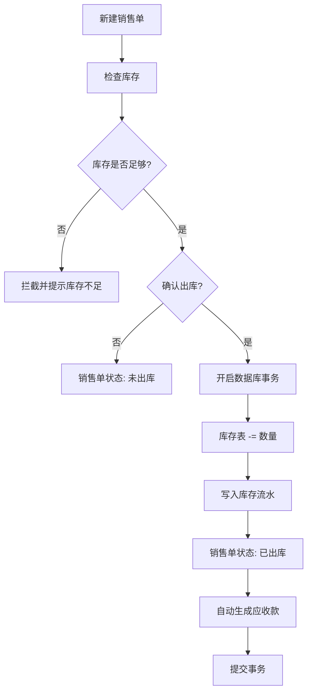

# 网页版进销存管理系统

## 详细开发计划文档

**版本**: v1.0  
**创建日期**: 2026-02-18  
**文档状态**: 待审核  
**适用对象**: 个人/小微企业自用，1～2人管理  
**文档作者**: 开发团队  

---

## 目录

1. [文档概述](#一文档概述)
2. [项目定位与需求边界](#二项目定位与需求边界)
3. [技术选型](#三技术选型)
4. [开发环境配置](#四开发环境配置)
5. [项目架构设计](#五项目架构设计)
6. [数据库设计](#六数据库设计)
7. [开发计划与里程碑](#七开发计划与里程碑)
8. [核心业务流程](#八核心业务流程)
9. [API 接口规范](#九api-接口规范)
10. [前端功能清单](#十前端功能清单)
11. [关键技术方案](#十一关键技术方案)
12. [测试策略](#十二测试策略)
13. [部署方案](#十三部署方案)
14. [风险评估与应对](#十四风险评估与应对)
15. [验收标准](#十五验收标准)
16. [后续迭代规划](#十六后续迭代规划)
17. [完整数据模型定义](#十七完整数据模型定义可直接落地)
18. [详细 API 接口文档](#十八详细-api-接口文档)
19. [核心业务逻辑实现](#十九核心业务逻辑实现可直接落地)
20. [权限控制矩阵](#二十权限控制矩阵)
21. [项目初始化脚本](#二十一项目初始化脚本可直接执行)

---

## 一、文档概述

### 1.1 文档目的
本文档旨在规范网页版进销存管理系统的开发流程，明确项目范围、技术选型、开发计划及验收标准，确保项目高质量、高效率交付。

### 1.2 适用范围
本系统适用于个人及小微企业的进销存管理，支持 1～2 人协作使用。

### 1.3 开发模式
单人全栈开发，采用快速迭代模式，优先实现核心功能，后续逐步完善。

### 1.4 项目目标
| 目标 | 说明 |
|------|------|
| 稳定可靠 | 系统运行稳定，数据准确无误 |
| 流程闭环 | 采购、销售、库存、财务完整流程覆盖 |
| 数据安全 | 完善的数据备份、权限控制及操作日志 |
| 快速交付 | 7～10 天完成核心功能开发并上线 |

---

## 二、项目定位与需求边界

### 2.1 项目定位
- **架构模式**: B/S 架构，支持本地、局域网及公网服务器部署
- **并发特性**: 低并发设计，重点保障数据准确性
- **功能范围**: 完整覆盖采购管理、销售管理、库存管理、应收应付及基础报表

### 2.2 功能边界（Scope Control）
为确保项目快速交付，以下功能暂不纳入开发范围：

| 功能类别 | 暂不开发内容 | 备注 |
|---------|-------------|------|
| 权限管理 | 多门店复杂权限体系 | 后续可迭代 |
| 财务功能 | 复杂财务会计分录 | 简化为应收应付 |
| 性能优化 | 高并发、分布式、微服务 | 当前场景无需 |
| 多端支持 | 小程序、App | 后续可迭代 |

### 2.3 用户角色定义

| 角色 | 权限范围 |
|------|---------|
| 管理员 | 系统全部功能权限 |
| 操作员 | 开单、查询权限，不可删单、改价 |

---

## 三、技术选型

### 3.1 后端技术栈
| 技术 | 版本 | 用途 |
|------|------|------|
| Python | 3.10+ | 开发语言 |
| Django | 4.2 (LTS) | Web 框架 |
| Django REST Framework | 3.14.0 | RESTful API 框架 |
| MySQL | 8.0+ | 关系型数据库 |
| Django-Cors-Headers | 4.0.0 | 跨域请求处理 |
| Gunicorn | 21.2.0 | WSGI 服务器 |
| djangorestframework-simplejwt | 5.3.0 | JWT 认证 |
| django-filter | 23.5 | 数据过滤 |

### 3.2 前端技术栈
| 技术 | 版本 | 用途 |
|------|------|------|
| Vue 3 | 3.x | 前端框架 |
| Vite | 4.x | 构建工具 |
| Element Plus | 2.x | UI 组件库 |
| Axios | 1.x | HTTP 客户端 |
| Vue Router | 4.x | 路由管理 |
| xlsx | 0.18.x | Excel 导出 |
| print-js | 1.x | 单据打印 |

### 3.4 部署说明
- 本地开发：直接运行
- 服务器部署：Docker + Docker Compose
- 数据备份：每日自动 SQL 备份

---

## 四、开发环境配置

### 4.1 后端环境配置
```bash
# 安装依赖包（使用清华镜像源加速）
pip install django==4.2 djangorestframework==3.14.0 mysqlclient==2.2.0 django-cors-headers==4.0.0 djangorestframework-simplejwt==5.3.0 django-filter==23.5 gunicorn==21.2.0 -i https://pypi.tuna.tsinghua.edu.cn/simple
```

### 4.2 前端环境配置
- Node.js: 16+
- 构建工具: Vite
- 推荐插件: Volar、ESLint
- 包管理器: npm 或 yarn

### 4.3 数据库配置
- 数据库: MySQL 8.0+
- 字符集: utf8mb4
- 存储引擎: InnoDB（支持事务）
- 排序规则: utf8mb4_unicode_ci

---

## 五、项目架构设计

### 5.1 后端项目结构
```
erp/
├── erp/                 # 项目配置目录
│   ├── settings.py      # Django 配置文件
│   ├── urls.py          # 主路由配置
│   └── wsgi.py          # WSGI 配置
├── system/              # 系统模块
│   ├── models.py        # 用户、角色、日志模型
│   ├── views.py         # 登录、权限视图
│   └── urls.py          # 模块路由
├── basic/               # 基础资料模块
│   ├── models.py        # 商品、分类、供应商、客户
│   ├── views.py         # CRUD 视图
│   └── urls.py
├── purchase/            # 采购模块
│   ├── models.py        # 采购单、采购明细
│   ├── views.py
│   └── urls.py
├── sale/                # 销售模块
│   ├── models.py        # 销售单、销售明细
│   ├── views.py
│   └── urls.py
├── inventory/           # 库存模块
│   ├── models.py        # 库存、库存流水、盘点
│   ├── views.py
│   └── urls.py
├── finance/             # 财务模块
│   ├── models.py        # 应收应付、收支记录
│   ├── views.py
│   └── urls.py
└── utils/               # 工具模块
    ├── export.py        # Excel 导出
    ├── print.py         # 打印功能
    └── common.py        # 公共函数
```

### 5.2 前端项目结构
```
web/
├── src/
│   ├── api/             # API 接口统一管理
│   │   ├── index.js     # axios 配置
│   │   ├── basic.js     # 基础资料接口
│   │   ├── purchase.js  # 采购接口
│   │   ├── sale.js      # 销售接口
│   │   └── ...
│   ├── views/           # 页面组件
│   ├── components/      # 通用组件
│   ├── router/          # 路由配置
│   └── utils/           # 工具函数
└── package.json
```

---

## 六、数据库设计

### 6.1 基础数据表
| 表名 | 说明 | 关键字段 |
|------|------|---------|
| User | 用户表 | id, username, password, role, phone |
| Role | 角色表 | id, name, permissions |
| Category | 商品分类表 | id, name, parent_id |
| Goods | 商品表 | id, name, code, category_id, unit, purchase_price, sale_price, retail_price |
| Warehouse | 仓库表 | id, name, address |
| Supplier | 供应商表 | id, name, contact, phone |
| Customer | 客户表 | id, name, contact, phone |

### 6.2 业务数据表
| 表名 | 说明 | 关键字段 |
|------|------|---------|
| PurchaseOrder | 采购主单 | id, order_no, supplier_id, warehouse_id, total_amount, paid_amount, status |
| PurchaseItem | 采购明细 | id, order_id, goods_id, quantity, received_quantity, price, amount |
| SaleOrder | 销售主单 | id, order_no, customer_id, warehouse_id, total_amount, received_amount, status |
| SaleItem | 销售明细 | id, order_id, goods_id, quantity, shipped_quantity, price, amount |
| StockIn | 入库单 | id, order_no, purchase_order_id, warehouse_id, total_amount, status, confirmed_at |
| StockOut | 出库单 | id, order_no, sale_order_id, warehouse_id, total_amount, status, confirmed_at |
| Inventory | 当前库存 | id, goods_id, warehouse_id, quantity |
| InventoryLog | 库存流水 | id, goods_id, warehouse_id, change_type, change_quantity, before_quantity, after_quantity, related_order_type, related_order_id |
| Payment | 收付款记录 | id, order_no, type, related_party_type, related_party_id, amount, payment_method, status, confirmed_at |
| Log | 操作日志 | id, user_id, action, module, detail, ip_address, created_at |

---

## 七、开发计划与里程碑

### 7.1 总体 timeline
```
第 1 天  ────────────────────────────────────► 第 10 天
├─ 环境登录 ─┤ 基础资料 ─┤ 采购 ─┤ 销售 ─┤ 库存 ─┤ 财务 ─┤ 报表 ─┤ 测试 ─┤
```

### 7.2 详细开发计划

#### Day 1: 环境搭建与用户系统
- [ ] 项目初始化（Django + Vue）
- [ ] MySQL 数据库配置
- [ ] CORS 跨域配置
- [ ] 用户认证模块（登录、Token）
- [ ] 权限控制框架

#### Day 2: 基础资料管理
- [ ] 商品分类管理（CRUD）
- [ ] 商品管理（CRUD、导入导出）
- [ ] 供应商管理
- [ ] 客户管理

#### Day 3: 采购管理模块
- [ ] 采购单创建
- [ ] 采购单列表与详情
- [ ] 采购入库功能
- [ ] 库存自动增加逻辑

#### Day 4: 销售管理模块
- [ ] 销售单创建
- [ ] 库存校验
- [ ] 销售出库功能
- [ ] 库存自动扣减逻辑

#### Day 5: 库存核心模块
- [ ] 实时库存查询
- [ ] 库存流水记录
- [ ] 简单盘点功能

#### Day 6: 财务管理模块
- [ ] 应收应付管理
- [ ] 收款功能
- [ ] 付款功能
- [ ] 单据状态联动更新

#### Day 7: 报表与优化
- [ ] 销售统计报表
- [ ] 采购统计报表
- [ ] 库存统计报表
- [ ] 利润简表

#### Day 8-10: 测试、修复与完善
- [ ] 流程闭环测试
- [ ] 数据准确性校验
- [ ] 打印模板开发
- [ ] Excel 导出功能
- [ ] Bug 修复

---

## 八、核心业务流程

### 8.1 采购入库流程


### 8.2 销售出库流程


### 8.3 库存安全规则
| 规则 | 说明 |
|------|------|
| 出库校验 | 所有出库操作必须先校验库存是否充足 |
| 事务保障 | 所有库存变更必须在数据库事务中执行 |
| 流水记录 | 每一笔库存变动都必须记录可追溯的流水 |
| 负库存控制 | 系统禁止负库存（可配置开关） |

---

## 九、API 接口规范

### 9.1 接口统一规范

#### 统一前缀
```
/api/v1/
```

#### 请求方式
| 方法 | 用途 | 幂等性 |
|------|------|--------|
| GET | 查询资源 | 是 |
| POST | 创建资源 | 否 |
| PUT | 完整更新资源 | 是 |
| PATCH | 部分更新资源 | 否 |
| DELETE | 删除资源 | 是 |

#### 统一响应格式
```json
{
  "code": 200,
  "msg": "操作成功",
  "data": {}
}
```

#### 状态码说明
| code | 说明 |
|------|------|
| 200 | 成功 |
| 400 | 请求参数错误 |
| 401 | 未登录/Token 过期 |
| 403 | 无权限 |
| 404 | 资源不存在 |
| 500 | 服务器内部错误 |

#### 分页参数
| 参数 | 类型 | 必填 | 说明 |
|------|------|------|------|
| page | int | 否 | 页码，默认 1 |
| size | int | 否 | 每页条数，默认 20 |

#### 认证方式
- 使用 JWT Token 认证
- Header: `Authorization: Bearer <token>`

---

## 十、前端功能清单

| 序号 | 功能模块 | 页面 |
|------|---------|------|
| 1 | 用户系统 | 登录页 |
| 2 | 首页 | 控制台（数据概览） |
| 3 | 基础资料 | 商品管理、供应商管理、客户管理 |
| 4 | 采购管理 | 采购单列表、新增、详情 |
| 5 | 销售管理 | 销售单列表、新增、详情 |
| 6 | 库存管理 | 库存查询、库存流水 |
| 7 | 财务管理 | 应收应付、收支记录 |
| 8 | 报表中心 | 各类统计报表 |
| 9 | 系统管理 | 系统设置、操作日志 |

---

## 十一、关键技术方案

### 11.1 库存准确性保障
| 方案 | 说明 |
|------|------|
| 事务机制 | 所有库存变更使用数据库事务，失败自动回滚 |
| 库存流水 | 建立 InventoryLog 表，记录每一笔变动的来源、数量、时间 |
| 盘点功能 | 支持定期盘点，修正库存差异 |

### 11.2 单据管理策略
| 场景 | 处理方案 |
|------|---------|
| 已出入库单据 | 禁止直接删除，只能红冲/作废 |
| 红冲操作 | 生成反向单据，同时生成反向库存记录 |
| 操作留痕 | 所有重要操作记录操作日志 |

### 11.3 金额精度控制
- 数据库字段：全部使用 `DecimalField`
- 前端计算：所有金额计算在后端完成
- 禁止使用：`float` 类型存储金额

### 11.4 并发控制
- 多商品出入库：循环 + 事务，单个失败全部回滚
- 使用数据库行级锁防止并发冲突

### 11.5 数据安全措施
| 措施 | 说明 |
|------|------|
| 密码加密 | 使用 Django 内置密码哈希 |
| 操作日志 | 记录谁、何时、做了什么操作 |
| 自动备份 | 每日自动备份数据库 |
| 二次确认 | 重要操作需要用户二次确认 |

### 11.6 打印与导出
- 单据打印：使用 A4 模板，支持 print-js
- Excel 导出：使用 xlsx 库
- 所有列表页支持导出功能

---

## 十二、测试策略

### 12.1 功能测试
| 测试项 | 预期结果 |
|--------|---------|
| 采购入库 | 库存数量正确增加 |
| 销售出库 | 库存数量正确减少 |
| 库存不足 | 系统拦截并提示 |
| 金额计算 | 价格、总额计算准确 |

### 12.2 流程测试
```
采购 → 入库 → 库存增加 → 销售 → 出库 → 库存减少 → 应收生成 → 收款
```

### 12.3 异常测试
- 断网场景
- 重复提交
- 非法参数
- 所有异常需做拦截处理

---

## 十三、部署方案

### 13.1 本地开发部署
```bash
# 启动后端服务
cd erp
python manage.py runserver 0.0.0.0:8000

# 启动前端服务
cd web
npm run dev

# 浏览器访问
http://localhost:5173
```

### 13.2 Docker 一键部署（生产环境）

#### 13.2.1 部署架构
```
┌─────────────────────────────────────────────────┐
│                    Nginx (80)                    │
│  ┌─────────────┐          ┌─────────────────┐  │
│  │   前端静态   │─────────▶│  Django (8000)  │  │
│  │   文件      │          │  Gunicorn       │  │
│  └─────────────┘          └────────┬────────┘  │
│                                     │           │
│                              ┌──────▼──────┐   │
│                              │  MySQL      │   │
│                              │ (远程)      │   │
│                              └─────────────┘   │
└─────────────────────────────────────────────────┘
```

#### 13.2.2 项目部署文件结构
```
deploy/
├── backend/              # Django 后端
│   ├── Dockerfile
│   └── requirements.txt
├── web/                  # Vue 前端
│   └── Dockerfile
├── nginx/
│   └── nginx.conf
├── ssl/                  # SSL 证书
│   └── ca.pem
├── docker-compose.yml
└── .env
```

#### 13.2.3 后端 Dockerfile
```dockerfile
FROM python:3.10-slim

WORKDIR /app

# 配置国内 pip 源
RUN pip config set global.index-url https://pypi.tuna.tsinghua.edu.cn/simple

# 安装系统依赖
RUN apt-get update && apt-get install -y \
    gcc \
    default-libmysqlclient-dev \
    pkg-config \
    && rm -rf /var/lib/apt/lists/*

COPY requirements.txt .
RUN pip install --no-cache-dir -r requirements.txt

COPY . .
RUN python manage.py collectstatic --noinput

EXPOSE 8000
CMD ["gunicorn", "--bind", "0.0.0.0:8000", "erp.wsgi:application"]
```

#### 13.2.4 前端 Dockerfile
```dockerfile
FROM node:18-alpine AS builder

WORKDIR /app
RUN npm config set registry https://registry.npmmirror.com

COPY package*.json ./
RUN npm install

COPY . .
RUN npm run build

FROM nginx:alpine
COPY --from=builder /app/dist /usr/share/nginx/html
COPY nginx.conf /etc/nginx/conf.d/default.conf

EXPOSE 80
CMD ["nginx", "-g", "daemon off;"]
```

#### 13.2.5 Nginx 配置
```nginx
server {
    listen 80;
    server_name _;
    root /usr/share/nginx/html;
    index index.html;

    # 前端 SPA 路由支持
    location / {
        try_files $uri $uri/ /index.html;
    }

    # API 代理
    location /api/ {
        proxy_pass http://backend:8000;
        proxy_set_header Host $host;
        proxy_set_header X-Real-IP $remote_addr;
        proxy_set_header X-Forwarded-For $proxy_add_x_forwarded_for;
        proxy_set_header X-Forwarded-Proto $scheme;
    }

    # 静态文件
    location /static/ {
        proxy_pass http://backend:8000;
    }
}
```

#### 13.2.6 Docker Compose 配置
```yaml
version: '3.8'

services:
  backend:
    build:
      context: ./backend
      dockerfile: Dockerfile
    container_name: erp-backend
    restart: always
    environment:
      - DJANGO_SETTINGS_MODULE=erp.settings
      - DB_HOST=${DB_HOST}
      - DB_PORT=${DB_PORT}
      - DB_NAME=${DB_NAME}
      - DB_USER=${DB_USER}
      - DB_PASSWORD=${DB_PASSWORD}
      - DB_SSL_CA=${DB_SSL_CA}
    volumes:
      - ./ssl:/app/ssl:ro
      - ./backend/logs:/app/logs
    networks:
      - erp-network

  frontend:
    build:
      context: ./web
      dockerfile: Dockerfile
    container_name: erp-frontend
    restart: always
    ports:
      - "80:80"
    depends_on:
      - backend
    networks:
      - erp-network

networks:
  erp-network:
    driver: bridge
```

#### 13.2.7 环境变量配置 (.env)
```env
# ==================== 数据库配置 ====================
DB_HOST=hantang.online
DB_PORT=65000
DB_NAME=haowei_db
DB_USER=test
DB_PASSWORD=Qq5183523
DB_SSL_CA=/app/ssl/ca.pem

# ==================== Django 配置 ====================
DEBUG=False
SECRET_KEY=your-secret-key-here-change-in-production
ALLOWED_HOSTS=*
```

#### 13.2.8 Django 数据库配置
```python
import os
from pathlib import Path

BASE_DIR = Path(__file__).resolve().parent.parent

DATABASES = {
    'default': {
        'ENGINE': 'django.db.backends.mysql',
        'HOST': os.environ.get('DB_HOST', 'localhost'),
        'PORT': os.environ.get('DB_PORT', '3306'),
        'NAME': os.environ.get('DB_NAME', 'erp'),
        'USER': os.environ.get('DB_USER', 'root'),
        'PASSWORD': os.environ.get('DB_PASSWORD', ''),
        'OPTIONS': {
            'charset': 'utf8mb4',
            'ssl': {
                'ca': os.environ.get('DB_SSL_CA', ''),
                'check_hostname': True,
            } if os.environ.get('DB_SSL_CA') else None,
        },
        'CONN_MAX_AGE': 60,
    }
}
```

#### 13.2.9 SSL 证书配置
```bash
# 1. 创建 SSL 证书目录
mkdir -p ssl

# 2. 放置 CA 证书（从数据库服务商获取）
# 将 ca.pem 复制到 ssl/ 目录

# 3. 设置证书权限
chmod 600 ssl/ca.pem
```

#### 13.2.10 部署执行步骤

**步骤 1: 准备部署文件**
```bash
# 确保所有部署文件在同一目录
ls -la
```

**步骤 2: 构建并启动容器**
```bash
docker-compose up -d --build
```

**步骤 3: 检查服务状态**
```bash
docker-compose ps
```

**步骤 4: 查看服务日志**
```bash
# 查看所有服务日志
docker-compose logs -f

# 单独查看后端日志
docker-compose logs -f backend

# 单独查看前端日志
docker-compose logs -f frontend
```

**步骤 5: 执行数据库迁移**
```bash
docker-compose exec backend python manage.py migrate
```

**步骤 6: 创建管理员账户**
```bash
docker-compose exec backend python manage.py createsuperuser
```

#### 13.2.11 连接验证

**验证 1: 测试数据库连接**
```bash
docker-compose exec backend bash
python manage.py dbshell
```

**验证 2: 测试 API 接口**
```bash
curl http://localhost/api/health/
```

**验证 3: 浏览器访问**
打开浏览器访问：`http://your-server-ip`

#### 13.2.12 常用运维命令
```bash
# 停止服务
docker-compose down

# 启动服务
docker-compose up -d

# 重启服务
docker-compose restart

# 更新代码后重新构建
docker-compose up -d --build

# 查看实时日志
docker-compose logs -f
```

### 13.3 数据备份策略

#### 13.3.1 自动备份脚本 (backup.sh)
```bash
#!/bin/bash

BACKUP_DIR="/data/backups"
DATE=$(date +%Y%m%d_%H%M%S)

# 数据库配置
DB_HOST="hantang.online"
DB_PORT="65000"
DB_NAME="haowei_db"
DB_USER="test"
DB_PASSWORD="Qq5183523"
SSL_CA="/app/ssl/ca.pem"

# 创建备份目录
mkdir -p $BACKUP_DIR

# 执行备份（使用 SSL 加密连接）
mysqldump --ssl-ca=$SSL_CA \
          --host=$DB_HOST \
          --port=$DB_PORT \
          --user=$DB_USER \
          --password=$DB_PASSWORD \
          --single-transaction \
          --routines \
          --triggers \
          $DB_NAME | gzip > $BACKUP_DIR/backup_$DATE.sql.gz

# 删除 7 天前的备份
find $BACKUP_DIR -name "backup_*.sql.gz" -mtime +7 -delete

echo "Backup completed: backup_$DATE.sql.gz"
```

#### 13.3.2 配置定时任务
```bash
# 编辑 crontab
crontab -e

# 添加定时任务（每天凌晨 2 点执行备份）
0 2 * * * /path/to/backup.sh >> /var/log/erp-backup.log 2>&1
```

---

## 十四、风险评估与应对

| 风险 | 影响 | 概率 | 应对措施 |
|------|------|------|---------|
| 需求蔓延 | 高 | 中 | 严格按计划开发，不额外增加功能 |
| 库存数据错误 | 高 | 中 | 事务 + 日志 + 流水，三重保障 |
| 数据丢失 | 高 | 低 | 每日自动备份，保留 7 天 |
| 开发延期 | 中 | 中 | 优先核心流程，先跑通再美化 |

---

## 十五、验收标准

### 15.1 功能验收
- [ ] 采购、销售、库存流程完整闭环
- [ ] 库存数据 100% 准确
- [ ] 应收应付计算正确
- [ ] 单据打印功能正常
- [ ] Excel 导出功能正常
- [ ] 操作日志完整可查

### 15.2 性能验收
- [ ] 系统稳定运行不崩溃
- [ ] 页面响应时间 < 3 秒
- [ ] 数据查询响应及时

### 15.3 用户体验验收
- [ ] 页面简洁易用
- [ ] 操作流程清晰
- [ ] 错误提示友好

---

## 十六、后续迭代规划

### 16.1 短期优化（v1.1）
- [ ] 条码扫描功能
- [ ] 小票打印支持
- [ ] 更多统计报表

### 16.2 中期规划（v2.0）
- [ ] 多门店支持
- [ ] 移动端适配
- [ ] 数据看板

### 16.3 长期展望
- [ ] 小程序/App
- [ ] 供应商/客户门户
- [ ] 智能数据分析

---

## 十七、完整数据模型定义（可直接落地）

### 17.1 基础模型（system/models.py）

```python
from django.db import models
from django.contrib.auth.models import AbstractUser
from django.utils import timezone


class Role(models.Model):
    """角色表"""
    name = models.CharField(max_length=50, unique=True, verbose_name='角色名称')
    permissions = models.JSONField(default=dict, verbose_name='权限列表')
    description = models.CharField(max_length=200, blank=True, verbose_name='描述')
    created_at = models.DateTimeField(auto_now_add=True, verbose_name='创建时间')
    updated_at = models.DateTimeField(auto_now=True, verbose_name='更新时间')

    class Meta:
        db_table = 'sys_role'
        verbose_name = '角色'
        verbose_name_plural = verbose_name

    def __str__(self):
        return self.name


class User(AbstractUser):
    """用户表（扩展 Django 默认 User）"""
    role = models.ForeignKey(Role, on_delete=models.SET_NULL, null=True, blank=True, verbose_name='角色')
    phone = models.CharField(max_length=20, blank=True, verbose_name='手机号')
    avatar = models.ImageField(upload_to='avatars/', blank=True, null=True, verbose_name='头像')
    is_active = models.BooleanField(default=True, verbose_name='是否启用')
    created_at = models.DateTimeField(auto_now_add=True, verbose_name='创建时间')
    updated_at = models.DateTimeField(auto_now=True, verbose_name='更新时间')

    class Meta:
        db_table = 'sys_user'
        verbose_name = '用户'
        verbose_name_plural = verbose_name

    def __str__(self):
        return self.username


class Log(models.Model):
    """操作日志表"""
    ACTION_CHOICES = [
        ('create', '创建'),
        ('update', '更新'),
        ('delete', '删除'),
        ('login', '登录'),
        ('logout', '登出'),
        ('other', '其他'),
    ]

    user = models.ForeignKey(User, on_delete=models.SET_NULL, null=True, verbose_name='操作用户')
    action = models.CharField(max_length=20, choices=ACTION_CHOICES, verbose_name='操作类型')
    module = models.CharField(max_length=50, verbose_name='操作模块')
    detail = models.TextField(verbose_name='操作详情')
    ip_address = models.GenericIPAddressField(null=True, blank=True, verbose_name='IP 地址')
    created_at = models.DateTimeField(auto_now_add=True, verbose_name='操作时间')

    class Meta:
        db_table = 'sys_log'
        verbose_name = '操作日志'
        verbose_name_plural = verbose_name
        ordering = ['-created_at']

    def __str__(self):
        return f'{self.user} - {self.action} - {self.created_at}'
```

### 17.2 基础资料模型（basic/models.py）

```python
from django.db import models
from django.utils import timezone


class Category(models.Model):
    """商品分类表"""
    name = models.CharField(max_length=100, verbose_name='分类名称')
    parent = models.ForeignKey('self', on_delete=models.SET_NULL, null=True, blank=True, 
                               related_name='children', verbose_name='父分类')
    sort_order = models.IntegerField(default=0, verbose_name='排序')
    is_active = models.BooleanField(default=True, verbose_name='是否启用')
    created_at = models.DateTimeField(auto_now_add=True, verbose_name='创建时间')
    updated_at = models.DateTimeField(auto_now=True, verbose_name='更新时间')

    class Meta:
        db_table = 'biz_category'
        verbose_name = '商品分类'
        verbose_name_plural = verbose_name
        ordering = ['sort_order', 'id']

    def __str__(self):
        return self.name


class Warehouse(models.Model):
    """仓库表"""
    name = models.CharField(max_length=100, verbose_name='仓库名称')
    address = models.CharField(max_length=200, blank=True, verbose_name='仓库地址')
    contact = models.CharField(max_length=50, blank=True, verbose_name='联系人')
    phone = models.CharField(max_length=20, blank=True, verbose_name='联系电话')
    is_active = models.BooleanField(default=True, verbose_name='是否启用')
    created_at = models.DateTimeField(auto_now_add=True, verbose_name='创建时间')
    updated_at = models.DateTimeField(auto_now=True, verbose_name='更新时间')

    class Meta:
        db_table = 'biz_warehouse'
        verbose_name = '仓库'
        verbose_name_plural = verbose_name

    def __str__(self):
        return self.name


class Supplier(models.Model):
    """供应商表"""
    name = models.CharField(max_length=100, verbose_name='供应商名称')
    contact = models.CharField(max_length=50, blank=True, verbose_name='联系人')
    phone = models.CharField(max_length=20, blank=True, verbose_name='联系电话')
    address = models.CharField(max_length=200, blank=True, verbose_name='地址')
    email = models.EmailField(blank=True, verbose_name='邮箱')
    balance = models.DecimalField(max_digits=14, decimal_places=2, default=0, verbose_name='应付余额')
    is_active = models.BooleanField(default=True, verbose_name='是否启用')
    created_at = models.DateTimeField(auto_now_add=True, verbose_name='创建时间')
    updated_at = models.DateTimeField(auto_now=True, verbose_name='更新时间')

    class Meta:
        db_table = 'biz_supplier'
        verbose_name = '供应商'
        verbose_name_plural = verbose_name

    def __str__(self):
        return self.name


class Customer(models.Model):
    """客户表"""
    name = models.CharField(max_length=100, verbose_name='客户名称')
    contact = models.CharField(max_length=50, blank=True, verbose_name='联系人')
    phone = models.CharField(max_length=20, blank=True, verbose_name='联系电话')
    address = models.CharField(max_length=200, blank=True, verbose_name='地址')
    email = models.EmailField(blank=True, verbose_name='邮箱')
    balance = models.DecimalField(max_digits=14, decimal_places=2, default=0, verbose_name='应收余额')
    is_active = models.BooleanField(default=True, verbose_name='是否启用')
    created_at = models.DateTimeField(auto_now_add=True, verbose_name='创建时间')
    updated_at = models.DateTimeField(auto_now=True, verbose_name='更新时间')

    class Meta:
        db_table = 'biz_customer'
        verbose_name = '客户'
        verbose_name_plural = verbose_name

    def __str__(self):
        return self.name


class Goods(models.Model):
    """商品表"""
    STATUS_CHOICES = [
        (0, '下架'),
        (1, '上架'),
    ]

    code = models.CharField(max_length=50, unique=True, verbose_name='商品编码')
    name = models.CharField(max_length=100, verbose_name='商品名称')
    category = models.ForeignKey(Category, on_delete=models.PROTECT, verbose_name='商品分类')
    unit = models.CharField(max_length=20, verbose_name='计量单位')
    spec = models.CharField(max_length=100, blank=True, verbose_name='规格')
    barcode = models.CharField(max_length=50, blank=True, verbose_name='条形码')
    purchase_price = models.DecimalField(max_digits=12, decimal_places=2, default=0, verbose_name='进货价')
    sale_price = models.DecimalField(max_digits=12, decimal_places=2, default=0, verbose_name='销售价')
    retail_price = models.DecimalField(max_digits=12, decimal_places=2, default=0, verbose_name='零售价')
    min_stock = models.IntegerField(default=0, verbose_name='最低库存')
    max_stock = models.IntegerField(default=0, verbose_name='最高库存')
    status = models.IntegerField(choices=STATUS_CHOICES, default=1, verbose_name='状态')
    remark = models.TextField(blank=True, verbose_name='备注')
    created_at = models.DateTimeField(auto_now_add=True, verbose_name='创建时间')
    updated_at = models.DateTimeField(auto_now=True, verbose_name='更新时间')

    class Meta:
        db_table = 'biz_goods'
        verbose_name = '商品'
        verbose_name_plural = verbose_name
        indexes = [
            models.Index(fields=['code']),
            models.Index(fields=['name']),
            models.Index(fields=['category']),
        ]

    def __str__(self):
        return f'{self.code} - {self.name}'
```

### 17.3 采购模型（purchase/models.py）

```python
from django.db import models
from django.utils import timezone
from basic.models import Supplier, Goods, Warehouse


class PurchaseOrder(models.Model):
    """采购主单"""
    STATUS_CHOICES = [
        ('pending', '待入库'),
        ('partial', '部分入库'),
        ('completed', '已入库'),
        ('cancelled', '已取消'),
    ]

    order_no = models.CharField(max_length=30, unique=True, verbose_name='采购单号')
    supplier = models.ForeignKey(Supplier, on_delete=models.PROTECT, verbose_name='供应商')
    warehouse = models.ForeignKey(Warehouse, on_delete=models.PROTECT, verbose_name='入库仓库')
    order_date = models.DateField(default=timezone.now, verbose_name='采购日期')
    total_amount = models.DecimalField(max_digits=14, decimal_places=2, default=0, verbose_name='总金额')
    paid_amount = models.DecimalField(max_digits=14, decimal_places=2, default=0, verbose_name='已付金额')
    status = models.CharField(max_length=20, choices=STATUS_CHOICES, default='pending', verbose_name='状态')
    remark = models.TextField(blank=True, verbose_name='备注')
    created_by = models.ForeignKey('system.User', on_delete=models.SET_NULL, null=True, 
                                   related_name='created_purchase_orders', verbose_name='创建人')
    created_at = models.DateTimeField(auto_now_add=True, verbose_name='创建时间')
    updated_at = models.DateTimeField(auto_now=True, verbose_name='更新时间')

    class Meta:
        db_table = 'biz_purchase_order'
        verbose_name = '采购单'
        verbose_name_plural = verbose_name
        ordering = ['-created_at']

    def __str__(self):
        return self.order_no


class PurchaseItem(models.Model):
    """采购明细"""
    order = models.ForeignKey(PurchaseOrder, on_delete=models.CASCADE, related_name='items', verbose_name='采购单')
    goods = models.ForeignKey(Goods, on_delete=models.PROTECT, verbose_name='商品')
    quantity = models.DecimalField(max_digits=12, decimal_places=2, verbose_name='数量')
    received_quantity = models.DecimalField(max_digits=12, decimal_places=2, default=0, verbose_name='已入库数量')
    price = models.DecimalField(max_digits=12, decimal_places=2, verbose_name='单价')
    amount = models.DecimalField(max_digits=14, decimal_places=2, verbose_name='金额')
    remark = models.CharField(max_length=200, blank=True, verbose_name='备注')

    class Meta:
        db_table = 'biz_purchase_item'
        verbose_name = '采购明细'
        verbose_name_plural = verbose_name

    def __str__(self):
        return f'{self.order.order_no} - {self.goods.name}'
```

### 17.4 销售模型（sale/models.py）

```python
from django.db import models
from django.utils import timezone
from basic.models import Customer, Goods, Warehouse


class SaleOrder(models.Model):
    """销售主单"""
    STATUS_CHOICES = [
        ('pending', '待出库'),
        ('partial', '部分出库'),
        ('completed', '已出库'),
        ('cancelled', '已取消'),
    ]

    order_no = models.CharField(max_length=30, unique=True, verbose_name='销售单号')
    customer = models.ForeignKey(Customer, on_delete=models.PROTECT, verbose_name='客户')
    warehouse = models.ForeignKey(Warehouse, on_delete=models.PROTECT, verbose_name='出库仓库')
    order_date = models.DateField(default=timezone.now, verbose_name='销售日期')
    total_amount = models.DecimalField(max_digits=14, decimal_places=2, default=0, verbose_name='总金额')
    received_amount = models.DecimalField(max_digits=14, decimal_places=2, default=0, verbose_name='已收金额')
    status = models.CharField(max_length=20, choices=STATUS_CHOICES, default='pending', verbose_name='状态')
    remark = models.TextField(blank=True, verbose_name='备注')
    created_by = models.ForeignKey('system.User', on_delete=models.SET_NULL, null=True, 
                                   related_name='created_sale_orders', verbose_name='创建人')
    created_at = models.DateTimeField(auto_now_add=True, verbose_name='创建时间')
    updated_at = models.DateTimeField(auto_now=True, verbose_name='更新时间')

    class Meta:
        db_table = 'biz_sale_order'
        verbose_name = '销售单'
        verbose_name_plural = verbose_name
        ordering = ['-created_at']

    def __str__(self):
        return self.order_no


class SaleItem(models.Model):
    """销售明细"""
    order = models.ForeignKey(SaleOrder, on_delete=models.CASCADE, related_name='items', verbose_name='销售单')
    goods = models.ForeignKey(Goods, on_delete=models.PROTECT, verbose_name='商品')
    quantity = models.DecimalField(max_digits=12, decimal_places=2, verbose_name='数量')
    shipped_quantity = models.DecimalField(max_digits=12, decimal_places=2, default=0, verbose_name='已出库数量')
    price = models.DecimalField(max_digits=12, decimal_places=2, verbose_name='单价')
    amount = models.DecimalField(max_digits=14, decimal_places=2, verbose_name='金额')
    remark = models.CharField(max_length=200, blank=True, verbose_name='备注')

    class Meta:
        db_table = 'biz_sale_item'
        verbose_name = '销售明细'
        verbose_name_plural = verbose_name

    def __str__(self):
        return f'{self.order.order_no} - {self.goods.name}'
```

### 17.5 库存模型（inventory/models.py）

```python
from django.db import models
from django.utils import timezone
from basic.models import Goods, Warehouse


class Inventory(models.Model):
    """当前库存表"""
    goods = models.ForeignKey(Goods, on_delete=models.CASCADE, verbose_name='商品')
    warehouse = models.ForeignKey(Warehouse, on_delete=models.CASCADE, verbose_name='仓库')
    quantity = models.DecimalField(max_digits=12, decimal_places=2, default=0, verbose_name='库存数量')
    created_at = models.DateTimeField(auto_now_add=True, verbose_name='创建时间')
    updated_at = models.DateTimeField(auto_now=True, verbose_name='更新时间')

    class Meta:
        db_table = 'biz_inventory'
        verbose_name = '库存'
        verbose_name_plural = verbose_name
        unique_together = ['goods', 'warehouse']
        indexes = [
            models.Index(fields=['goods']),
            models.Index(fields=['warehouse']),
        ]

    def __str__(self):
        return f'{self.goods.name} - {self.warehouse.name}: {self.quantity}'


class InventoryLog(models.Model):
    """库存流水表"""
    CHANGE_TYPE_CHOICES = [
        ('inbound', '入库'),
        ('outbound', '出库'),
        ('adjust', '库存调整'),
        ('check', '盘点'),
    ]

    goods = models.ForeignKey(Goods, on_delete=models.CASCADE, verbose_name='商品')
    warehouse = models.ForeignKey(Warehouse, on_delete=models.CASCADE, verbose_name='仓库')
    change_type = models.CharField(max_length=20, choices=CHANGE_TYPE_CHOICES, verbose_name='变动类型')
    change_quantity = models.DecimalField(max_digits=12, decimal_places=2, verbose_name='变动数量')
    before_quantity = models.DecimalField(max_digits=12, decimal_places=2, verbose_name='变动前数量')
    after_quantity = models.DecimalField(max_digits=12, decimal_places=2, verbose_name='变动后数量')
    related_order_type = models.CharField(max_length=50, blank=True, verbose_name='关联单据类型')
    related_order_id = models.IntegerField(null=True, blank=True, verbose_name='关联单据ID')
    remark = models.CharField(max_length=200, blank=True, verbose_name='备注')
    created_by = models.ForeignKey('system.User', on_delete=models.SET_NULL, null=True, verbose_name='操作人')
    created_at = models.DateTimeField(auto_now_add=True, verbose_name='操作时间')

    class Meta:
        db_table = 'biz_inventory_log'
        verbose_name = '库存流水'
        verbose_name_plural = verbose_name
        ordering = ['-created_at']
        indexes = [
            models.Index(fields=['goods']),
            models.Index(fields=['warehouse']),
            models.Index(fields=['created_at']),
        ]

    def __str__(self):
        return f'{self.goods.name} - {self.change_type} - {self.created_at}'


class StockIn(models.Model):
    """入库单"""
    STATUS_CHOICES = [
        ('draft', '草稿'),
        ('confirmed', '已确认'),
        ('cancelled', '已取消'),
    ]

    order_no = models.CharField(max_length=30, unique=True, verbose_name='入库单号')
    purchase_order = models.ForeignKey('purchase.PurchaseOrder', on_delete=models.SET_NULL, 
                                        null=True, blank=True, verbose_name='关联采购单')
    warehouse = models.ForeignKey(Warehouse, on_delete=models.PROTECT, verbose_name='仓库')
    total_amount = models.DecimalField(max_digits=14, decimal_places=2, default=0, verbose_name='总金额')
    status = models.CharField(max_length=20, choices=STATUS_CHOICES, default='draft', verbose_name='状态')
    remark = models.TextField(blank=True, verbose_name='备注')
    created_by = models.ForeignKey('system.User', on_delete=models.SET_NULL, null=True, verbose_name='创建人')
    created_at = models.DateTimeField(auto_now_add=True, verbose_name='创建时间')
    confirmed_at = models.DateTimeField(null=True, blank=True, verbose_name='确认时间')

    class Meta:
        db_table = 'biz_stock_in'
        verbose_name = '入库单'
        verbose_name_plural = verbose_name
        ordering = ['-created_at']

    def __str__(self):
        return self.order_no


class StockOut(models.Model):
    """出库单"""
    STATUS_CHOICES = [
        ('draft', '草稿'),
        ('confirmed', '已确认'),
        ('cancelled', '已取消'),
    ]

    order_no = models.CharField(max_length=30, unique=True, verbose_name='出库单号')
    sale_order = models.ForeignKey('sale.SaleOrder', on_delete=models.SET_NULL, 
                                   null=True, blank=True, verbose_name='关联销售单')
    warehouse = models.ForeignKey(Warehouse, on_delete=models.PROTECT, verbose_name='仓库')
    total_amount = models.DecimalField(max_digits=14, decimal_places=2, default=0, verbose_name='总金额')
    status = models.CharField(max_length=20, choices=STATUS_CHOICES, default='draft', verbose_name='状态')
    remark = models.TextField(blank=True, verbose_name='备注')
    created_by = models.ForeignKey('system.User', on_delete=models.SET_NULL, null=True, verbose_name='创建人')
    created_at = models.DateTimeField(auto_now_add=True, verbose_name='创建时间')
    confirmed_at = models.DateTimeField(null=True, blank=True, verbose_name='确认时间')

    class Meta:
        db_table = 'biz_stock_out'
        verbose_name = '出库单'
        verbose_name_plural = verbose_name
        ordering = ['-created_at']

    def __str__(self):
        return self.order_no
```

### 17.6 财务模型（finance/models.py）

```python
from django.db import models
from django.utils import timezone


class Payment(models.Model):
    """收付款记录表"""
    TYPE_CHOICES = [
        ('receive', '收款'),
        ('pay', '付款'),
    ]

    STATUS_CHOICES = [
        ('pending', '待确认'),
        ('confirmed', '已确认'),
        ('cancelled', '已取消'),
    ]

    order_no = models.CharField(max_length=30, unique=True, verbose_name='单据编号')
    type = models.CharField(max_length=10, choices=TYPE_CHOICES, verbose_name='类型')
    related_party_type = models.CharField(max_length=50, verbose_name='往来单位类型')
    related_party_id = models.IntegerField(verbose_name='往来单位ID')
    amount = models.DecimalField(max_digits=14, decimal_places=2, verbose_name='金额')
    payment_method = models.CharField(max_length=50, blank=True, verbose_name='付款方式')
    status = models.CharField(max_length=20, choices=STATUS_CHOICES, default='pending', verbose_name='状态')
    remark = models.TextField(blank=True, verbose_name='备注')
    created_by = models.ForeignKey('system.User', on_delete=models.SET_NULL, null=True, verbose_name='创建人')
    created_at = models.DateTimeField(auto_now_add=True, verbose_name='创建时间')
    confirmed_at = models.DateTimeField(null=True, blank=True, verbose_name='确认时间')

    class Meta:
        db_table = 'biz_payment'
        verbose_name = '收付款记录'
        verbose_name_plural = verbose_name
        ordering = ['-created_at']

    def __str__(self):
        return f'{self.order_no} - {self.get_type_display()} - {self.amount}'
```

---

## 十八、详细 API 接口文档

### 18.1 认证接口

#### 18.1.1 用户登录
- **接口**: `POST /api/v1/auth/login/`
- **请求**:
```json
{
  "username": "admin",
  "password": "123456"
}
```
- **响应**:
```json
{
  "code": 200,
  "msg": "登录成功",
  "data": {
    "token": "eyJhbGciOiJIUzI1NiIsInR5cCI6IkpXVCJ9...",
    "user": {
      "id": 1,
      "username": "admin",
      "role": "管理员"
    }
  }
}
```

#### 18.1.2 用户登出
- **接口**: `POST /api/v1/auth/logout/`
- **响应**:
```json
{
  "code": 200,
  "msg": "登出成功"
}
```

#### 18.1.3 获取当前用户信息
- **接口**: `GET /api/v1/auth/me/`
- **响应**:
```json
{
  "code": 200,
  "msg": "成功",
  "data": {
    "id": 1,
    "username": "admin",
    "role": "管理员",
    "permissions": []
  }
}
```

---

### 18.3 商品管理接口

#### 18.3.1 商品列表
- **接口**: `GET /api/v1/basic/goods/`
- **查询参数**:
  - `page`: 页码（默认 1）
  - `size`: 每页数量（默认 20）
  - `keyword`: 搜索关键词（商品编码/名称）
  - `category_id`: 分类 ID
- **响应**:
```json
{
  "code": 200,
  "msg": "成功",
  "data": {
    "total": 100,
    "page": 1,
    "size": 20,
    "items": [
      {
        "id": 1,
        "code": "G001",
        "name": "示例商品",
        "category": {
          "id": 1,
          "name": "分类1"
        },
        "unit": "个",
        "purchase_price": "100.00",
        "sale_price": "150.00",
        "status": 1
      }
    ]
  }
}
```

#### 18.3.2 商品详情
- **接口**: `GET /api/v1/basic/goods/{id}/`
- **响应**:
```json
{
  "code": 200,
  "msg": "成功",
  "data": {
    "id": 1,
    "code": "G001",
    "name": "示例商品",
    "category": {
      "id": 1,
      "name": "分类1"
    },
    "unit": "个",
    "spec": "规格",
    "barcode": "6901234567890",
    "purchase_price": "100.00",
    "sale_price": "150.00",
    "retail_price": "180.00",
    "min_stock": 10,
    "max_stock": 1000,
    "status": 1,
    "remark": "备注"
  }
}
```

#### 18.3.3 新增商品
- **接口**: `POST /api/v1/basic/goods/`
- **请求**:
```json
{
  "code": "G002",
  "name": "新商品",
  "category_id": 1,
  "unit": "个",
  "purchase_price": "50.00",
  "sale_price": "80.00",
  "status": 1
}
```
- **响应**:
```json
{
  "code": 200,
  "msg": "创建成功",
  "data": {
    "id": 2,
    "code": "G002",
    "name": "新商品"
  }
}
```

#### 18.3.4 更新商品
- **接口**: `PUT /api/v1/basic/goods/{id}/`
- **请求**: 同新增商品
- **响应**: 同新增商品

#### 18.3.5 删除商品
- **接口**: `DELETE /api/v1/basic/goods/{id}/`
- **响应**:
```json
{
  "code": 200,
  "msg": "删除成功"
}
```

---

### 18.4 采购管理接口

#### 18.4.1 采购单列表
- **接口**: `GET /api/v1/purchase/orders/`
- **查询参数**:
  - `page`, `size`: 分页
  - `status`: 状态筛选
  - `supplier_id`: 供应商 ID
  - `start_date`, `end_date`: 日期范围
- **响应**:
```json
{
  "code": 200,
  "msg": "成功",
  "data": {
    "total": 50,
    "items": [
      {
        "id": 1,
        "order_no": "PO202602180001",
        "supplier": {
          "id": 1,
          "name": "供应商A"
        },
        "warehouse": {
          "id": 1,
          "name": "主仓库"
        },
        "order_date": "2026-02-18",
        "total_amount": "1000.00",
        "status": "pending",
        "created_at": "2026-02-18T10:00:00Z"
      }
    ]
  }
}
```

#### 18.4.2 采购单详情
- **接口**: `GET /api/v1/purchase/orders/{id}/`
- **响应**包含采购单信息和明细列表

#### 18.4.3 创建采购单
- **接口**: `POST /api/v1/purchase/orders/`
- **请求**:
```json
{
  "supplier_id": 1,
  "warehouse_id": 1,
  "order_date": "2026-02-18",
  "items": [
    {
      "goods_id": 1,
      "quantity": 10,
      "price": "100.00"
    }
  ],
  "remark": "备注"
}
```

#### 18.4.4 确认采购入库
- **接口**: `POST /api/v1/purchase/orders/{id}/confirm_inbound/`
- **响应**:
```json
{
  "code": 200,
  "msg": "入库成功"
}
```

---

### 18.5 销售管理接口

#### 18.5.1 销售单列表
- **接口**: `GET /api/v1/sale/orders/`
- **查询参数**: 同采购单

#### 18.5.2 销售单详情
- **接口**: `GET /api/v1/sale/orders/{id}/`

#### 18.5.3 创建销售单
- **接口**: `POST /api/v1/sale/orders/`
- **请求**:
```json
{
  "customer_id": 1,
  "warehouse_id": 1,
  "order_date": "2026-02-18",
  "items": [
    {
      "goods_id": 1,
      "quantity": 5,
      "price": "150.00"
    }
  ],
  "remark": "备注"
}
```

#### 18.5.4 确认销售出库
- **接口**: `POST /api/v1/sale/orders/{id}/confirm_outbound/`
- **响应**:
```json
{
  "code": 200,
  "msg": "出库成功"
}
```

---

### 18.6 库存管理接口

#### 18.6.1 库存查询
- **接口**: `GET /api/v1/inventory/stock/`
- **查询参数**:
  - `page`, `size`: 分页
  - `warehouse_id`: 仓库 ID
  - `keyword`: 商品关键词
- **响应**:
```json
{
  "code": 200,
  "msg": "成功",
  "data": {
    "total": 100,
    "items": [
      {
        "id": 1,
        "goods": {
          "id": 1,
          "code": "G001",
          "name": "商品1"
        },
        "warehouse": {
          "id": 1,
          "name": "主仓库"
        },
        "quantity": "100.00"
      }
    ]
  }
}
```

#### 18.6.2 库存流水
- **接口**: `GET /api/v1/inventory/logs/`
- **查询参数**:
  - `page`, `size`: 分页
  - `goods_id`: 商品 ID
  - `warehouse_id`: 仓库 ID
  - `change_type`: 变动类型
  - `start_date`, `end_date`: 日期范围

---

## 十九、核心业务逻辑实现（可直接落地）

### 19.1 采购入库业务逻辑

```python
from django.db import transaction, models
from django.core.exceptions import ValidationError
from purchase.models import PurchaseOrder, PurchaseItem
from inventory.models import Inventory, InventoryLog, StockIn
from basic.models import Warehouse
import time


@transaction.atomic
def confirm_purchase_inbound(order_id, operator_id=None):
    """
    确认采购入库
    
    Args:
        order_id: 采购单 ID
        operator_id: 操作用户 ID
    
    Returns:
        StockIn: 入库单对象
    """
    # 1. 获取采购单并加锁
    order = PurchaseOrder.objects.select_for_update().get(id=order_id)
    
    # 2. 状态校验
    if order.status not in ['pending', 'partial']:
        raise ValidationError('只有待入库或部分入库的采购单可以入库')
    
    # 3. 获取未完全入库的明细
    items = PurchaseItem.objects.filter(order=order, received_quantity__lt=models.F('quantity'))
    
    if not items.exists():
        raise ValidationError('没有需要入库的商品')
    
    # 4. 创建入库单
    # 注意：此处总金额为订单剩余应付金额，可根据业务需求调整为本次入库商品金额
    stock_in = StockIn.objects.create(
        order_no=f'IN{time.strftime("%Y%m%d%H%M%S")}',
        purchase_order=order,
        warehouse=order.warehouse,
        total_amount=order.total_amount - order.paid_amount,
        status='confirmed',
        created_by_id=operator_id
    )
    
    # 5. 处理每个明细
    for item in items:
        goods = item.goods
        warehouse = order.warehouse
        inbound_quantity = item.quantity - item.received_quantity
        
        # 获取或创建库存记录
        inventory, created = Inventory.objects.select_for_update().get_or_create(
            goods=goods,
            warehouse=warehouse,
            defaults={'quantity': 0}
        )
        
        # 记录变动前数量
        before_quantity = inventory.quantity
        
        # 更新库存
        inventory.quantity += inbound_quantity
        inventory.save()
        
        # 记录库存流水
        InventoryLog.objects.create(
            goods=goods,
            warehouse=warehouse,
            change_type='inbound',
            change_quantity=inbound_quantity,
            before_quantity=before_quantity,
            after_quantity=inventory.quantity,
            related_order_type='purchase',
            related_order_id=order.id,
            remark=f'采购单入库: {order.order_no}',
            created_by_id=operator_id
        )
        
        # 更新采购明细已入库数量
        item.received_quantity = item.quantity
        item.save()
    
    # 6. 更新采购单状态
    all_received = PurchaseItem.objects.filter(order=order).exclude(
        received_quantity=models.F('quantity')
    ).count() == 0
    
    order.status = 'completed' if all_received else 'partial'
    order.save()
    
    return stock_in
```

### 19.2 销售出库业务逻辑

```python
from django.db import transaction, models
from django.core.exceptions import ValidationError
from sale.models import SaleOrder, SaleItem
from inventory.models import Inventory, InventoryLog, StockOut
import time


@transaction.atomic
def confirm_sale_outbound(order_id, operator_id=None):
    """
    确认销售出库
    
    Args:
        order_id: 销售单 ID
        operator_id: 操作用户 ID
    
    Returns:
        StockOut: 出库单对象
    """
    # 1. 获取销售单并加锁
    order = SaleOrder.objects.select_for_update().get(id=order_id)
    
    # 2. 状态校验
    if order.status not in ['pending', 'partial']:
        raise ValidationError('只有待出库或部分出库的销售单可以出库')
    
    # 3. 获取未完全出库的明细
    items = SaleItem.objects.filter(order=order, shipped_quantity__lt=models.F('quantity'))
    
    if not items.exists():
        raise ValidationError('没有需要出库的商品')
    
    # 4. 校验库存是否充足
    warehouse = order.warehouse
    for item in items:
        outbound_quantity = item.quantity - item.shipped_quantity
        try:
            inventory = Inventory.objects.get(goods=item.goods, warehouse=warehouse)
            if inventory.quantity < outbound_quantity:
                raise ValidationError(
                    f'商品 {item.goods.name} 库存不足！'
                    f'当前库存: {inventory.quantity}, 需要: {outbound_quantity}'
                )
        except Inventory.DoesNotExist:
            raise ValidationError(f'商品 {item.goods.name} 没有库存！')
    
    # 5. 创建出库单
    # 注意：此处总金额为订单剩余应收金额，可根据业务需求调整为本次出库商品金额
    stock_out = StockOut.objects.create(
        order_no=f'OUT{time.strftime("%Y%m%d%H%M%S")}',
        sale_order=order,
        warehouse=warehouse,
        total_amount=order.total_amount - order.received_amount,
        status='confirmed',
        created_by_id=operator_id
    )
    
    # 6. 处理每个明细
    for item in items:
        goods = item.goods
        outbound_quantity = item.quantity - item.shipped_quantity
        
        # 获取库存记录（已加锁）
        inventory = Inventory.objects.select_for_update().get(
            goods=goods,
            warehouse=warehouse
        )
        
        # 记录变动前数量
        before_quantity = inventory.quantity
        
        # 更新库存
        inventory.quantity -= outbound_quantity
        inventory.save()
        
        # 记录库存流水
        InventoryLog.objects.create(
            goods=goods,
            warehouse=warehouse,
            change_type='outbound',
            change_quantity=outbound_quantity,
            before_quantity=before_quantity,
            after_quantity=inventory.quantity,
            related_order_type='sale',
            related_order_id=order.id,
            remark=f'销售单出库: {order.order_no}',
            created_by_id=operator_id
        )
        
        # 更新销售明细已出库数量
        item.shipped_quantity = item.quantity
        item.save()
    
    # 7. 更新销售单状态
    all_shipped = SaleItem.objects.filter(order=order).exclude(
        shipped_quantity=models.F('quantity')
    ).count() == 0
    
    order.status = 'completed' if all_shipped else 'partial'
    order.save()
    
    return stock_out
```

---

## 二十、权限控制矩阵

| 功能模块 | 操作 | 管理员 | 操作员 |
|---------|------|--------|--------|
| **用户管理** | 查看 | ✅ | ❌ |
| | 新增/编辑 | ✅ | ❌ |
| | 删除 | ✅ | ❌ |
| **商品分类** | 查看 | ✅ | ✅ |
| | 新增/编辑 | ✅ | ❌ |
| | 删除 | ✅ | ❌ |
| **商品管理** | 查看 | ✅ | ✅ |
| | 新增 | ✅ | ❌ |
| | 编辑 | ✅ | ❌ |
| | 改价 | ✅ | ❌ |
| | 删除 | ✅ | ❌ |
| **供应商管理** | 查看 | ✅ | ✅ |
| | 新增/编辑 | ✅ | ❌ |
| | 删除 | ✅ | ❌ |
| **客户管理** | 查看 | ✅ | ✅ |
| | 新增/编辑 | ✅ | ❌ |
| | 删除 | ✅ | ❌ |
| **采购单** | 查看 | ✅ | ✅ |
| | 新增 | ✅ | ✅ |
| | 编辑 | ✅ | ❌ |
| | 删除 | ✅ | ❌ |
| | 确认入库 | ✅ | ✅ |
| **销售单** | 查看 | ✅ | ✅ |
| | 新增 | ✅ | ✅ |
| | 编辑 | ✅ | ❌ |
| | 删除 | ✅ | ❌ |
| | 改价 | ✅ | ❌ |
| | 确认出库 | ✅ | ✅ |
| **库存查询** | 查看 | ✅ | ✅ |
| **库存流水** | 查看 | ✅ | ✅ |
| **库存盘点** | 操作 | ✅ | ✅ |
| **应收应付** | 查看 | ✅ | ✅ |
| | 收款 | ✅ | ✅ |
| | 付款 | ✅ | ✅ |
| **报表** | 查看 | ✅ | ✅ |
| **系统设置** | 操作 | ✅ | ❌ |
| **操作日志** | 查看 | ✅ | ❌ |

---

## 二十一、项目初始化脚本（可直接执行）

### 21.1 创建 Django 项目结构

```bash
#!/bin/bash
# create_project.sh

PROJECT_NAME="erp"

# 创建项目根目录
mkdir -p $PROJECT_NAME
cd $PROJECT_NAME

# 创建 Django 项目
django-admin startproject $PROJECT_NAME .

# 创建 App
python manage.py startapp system
python manage.py startapp basic
python manage.py startapp purchase
python manage.py startapp sale
python manage.py startapp inventory
python manage.py startapp finance
python manage.py startapp utils

# 创建目录结构
mkdir -p $PROJECT_NAME/{templates,static}
mkdir -p logs
mkdir -p media/{avatars,uploads}

# 创建 requirements.txt
cat > requirements.txt << 'EOF'
Django==4.2
djangorestframework==3.14.0
mysqlclient==2.2.0
django-cors-headers==4.0.0
gunicorn==21.2.0
djangorestframework-simplejwt==5.3.0
django-filter==23.5
EOF

echo "项目结构创建完成！"
```

### 21.2 初始化数据脚本

```python
# init_data.py
from django.contrib.auth import get_user_model
from system.models import Role

def init_system_data():
    """初始化系统数据"""
    
    # 创建角色
    admin_role, _ = Role.objects.get_or_create(
        name='管理员',
        defaults={
            'permissions': {},
            'description': '系统管理员，拥有全部权限'
        }
    )
    
    operator_role, _ = Role.objects.get_or_create(
        name='操作员',
        defaults={
            'permissions': {},
            'description': '普通操作员，可开单查询'
        }
    )
    
    # 创建管理员用户
    User = get_user_model()
    admin_user, created = User.objects.get_or_create(
        username='admin',
        defaults={
            'role': admin_role,
            'is_superuser': True,
            'is_staff': True,
        }
    )
    
    if created:
        admin_user.set_password('admin123')
        admin_user.save()
        print(f'管理员用户创建成功: admin / admin123')
    else:
        print(f'管理员用户已存在')
```

---

**文档结束**

---
*本计划文档将根据项目进展动态更新*
